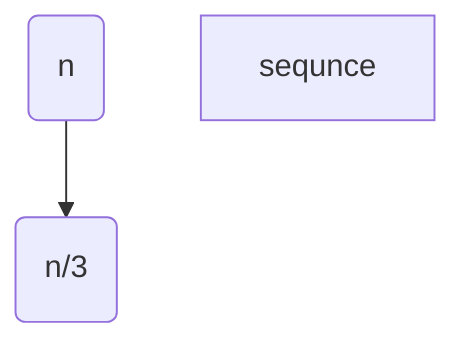

### Exemplo 
$\large T(n) = T(\frac{n}{3}) + T(\frac{2n}{3}) + \theta(n)$ 

```mermaid
graph TD

t(n) --> T(n/3) 
sequnce
``` 

##### ex
$\large T(n) = 2T(\frac{n}{5}) + 3T(\frac{n}{6}) + n$

![[arvore_ex1.excalidraw]]
